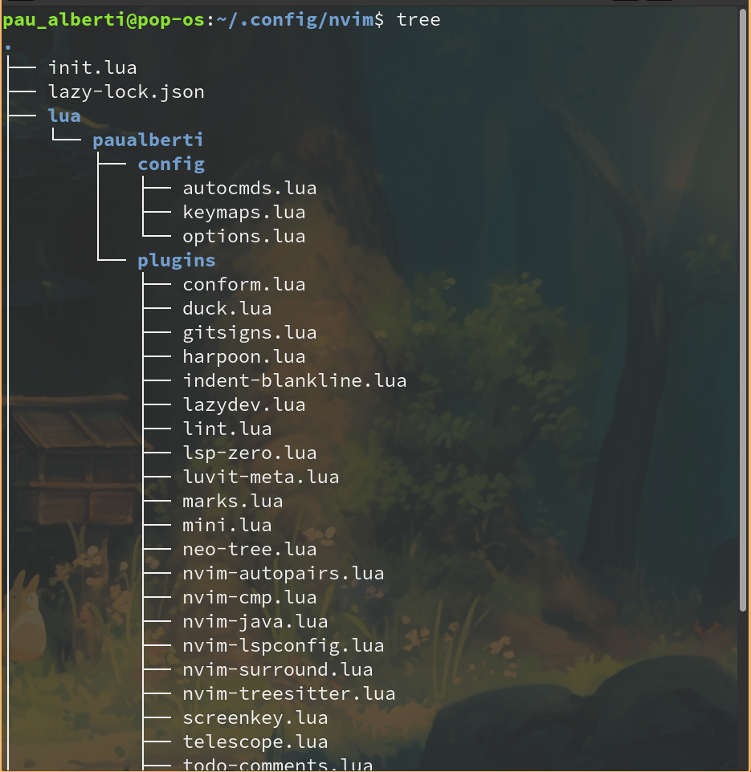

# Neovim Configuration
## How to use
### How it looks

### Setup
```
git clone https://github.com/paualberti/nvim ~/.config/nvim
```
### Recommended changes
If you want to make this configuration your own
* Change every reference of paualberti to yourname
    - Directori and use inside init.lua
